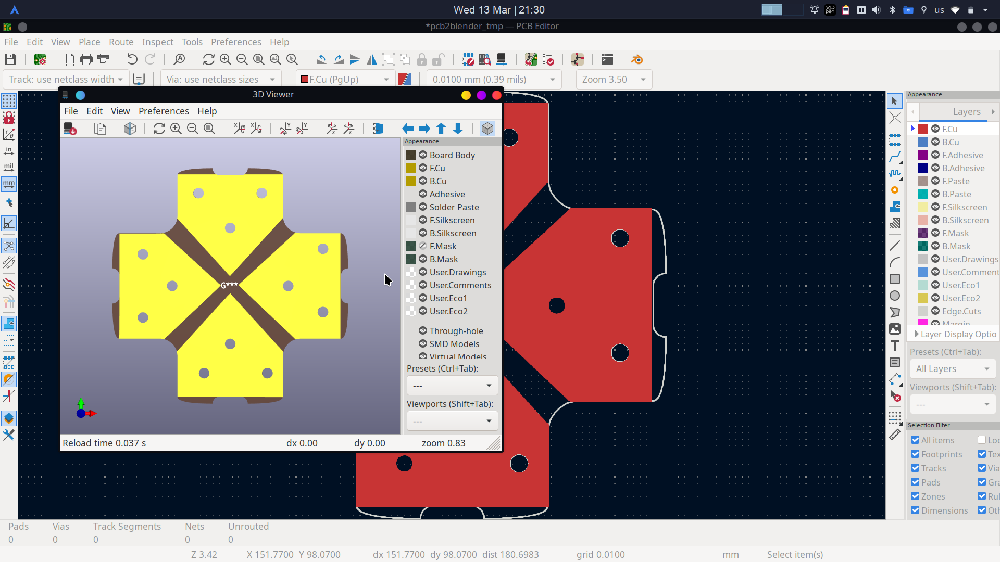
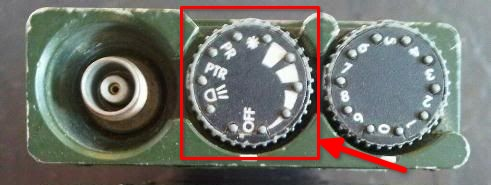
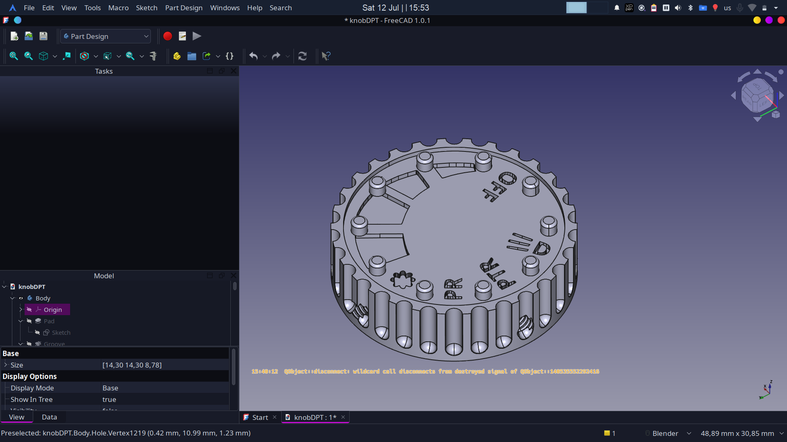
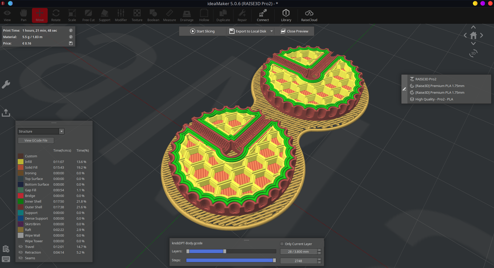

# Design2PCB 

## Overview
**🚧 Note: This project is currently under construction.** I'm in the process of adding new designs, refining existing ones, and updating documentation. Expect regular updates, and feel free to contribute or provide feedback!

Welcome to **Design2PCB**, a dynamic repository showcasing custom PCB designs and footprints. Our project elegantly blends detailed KiCad schematics and PCB layouts, originally designed with CAD modeling, and features unique footprints derived from Inkscape illustrations, converted for KiCad use. Dive into the seamless integration of mechanical CAD modeling and graphic design into the PCB design process, employing a powerful combination of FreeCAD, Inkscape, and KiCad.

## Installation and Requirements
Ensure you have the following software installed on your computer:
- **KiCad** (Version 8.0.0 or later)
- **FreeCAD** (Version 0.21.2 or later)
- **Inkscape** (Version 1.3.2 or later)

For installation instructions, please refer to the official websites of [KiCad](https://www.kicad.org/), [FreeCAD](https://www.freecadweb.org/), and [Inkscape](https://inkscape.org/).

## Usage Instructions

- #### KiCad Projects
Navigate to the `/KiCad_Projects` folder to access the KiCad schematics and PCB layout files. Use KiCad to open these files for viewing, editing, or extending the designs.

- #### FreeCAD Footprints
Find custom footprints designed in FreeCAD in the `/FreeCAD_Footprints` folder, ready to be imported into KiCad for your PCB designs.

- #### Inkscape Designs to KiCad Footprints
The `/Inkscape_Designs` folder contains the original SVG files created in Inkscape. Follow the conversion process outlined in the corresponding README to turn these designs into KiCad footprints.

## 🛠️ 3D-Printed Designs

### PRM-4720 Volume Knob — Concept ➜ Print ➜ Reality

| Stage | Preview |
|-------|---------|
| **1. Reference Part** Original PRM-4720 knob used for reverse-engineering |  |
| **2. CAD Model (FreeCAD)** Parametric model with knurled grip, set-screw slot & indicator line |  |
| **3. Slicer Preview (ideaMaker)** G-code inspection and infill check before printing |  |
| **4. Finished Print** PLA-plus, 0.16 mm layers, silk-black filament |  |

## License

This repository is licensed under the MIT License - see the [LICENSE](LICENSE) file for details.

---

**Thank you for visiting Design2PCB!**
